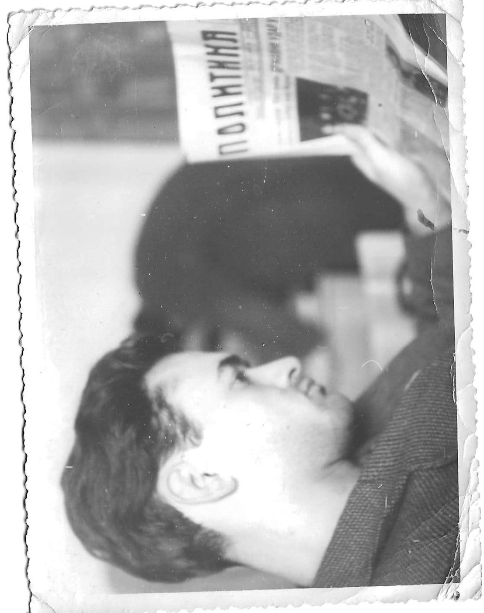

# Dobrosav “Doca” Basarić  
*September 2, 1937 – November 3, 2025*

It is with deep sadness that we announce the passing of Dobrosav “Doca” Basarić on November 3, 2025. Doca passed away peacefully under the compassionate care of the Sunnybrook Hospital team in Toronto.

He is lovingly remembered by his devoted wife of 64 years, Milena; his cherished children, Aleksandar (Snezana) and Lidia (Nebojsa); and his adored grandchildren, Marko, Filip, Katarina, and Luka.

Born in Kragujevac, Serbia, on September 2, 1937, Doca was an engineer both by education and by nature. He approached every challenge with enthusiasm, curiosity, and precision—whether it was an engineering project at work, repairing his own car, or building custom-made furniture for his family home.

Doca will be remembered for his out-of-the-box thinking, intelligence, sense of humor, and unwavering love for his family. His wit and wisdom will be deeply missed.

In keeping with his wishes, cremation has taken place.

Friends of the family are invited to express their condolences at **Mount Pleasant Cemetery’s Funeral Centre** (375 Mount Pleasant Road, Toronto) on Sunday, **November 16th from 11:00 a.m**. The memorial service will begin at 12 noon, followed by a small reception.

In lieu of flowers, the family encourages donations to the Sunnybrook Foundation or to a charity of your choice, in Doca’s memory.

---

*(Family of Dobrosav “Doca” Basarić)*  
