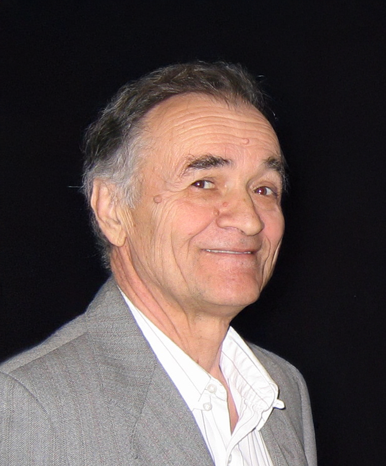

[🇷🇸 Srpski](doca) | [🇬🇧 English](dad)

# Dobrosav Basarić – Doca  
*September 2, 1937 – November 3, 2025*

S tugom u srcima delimo vest sa vama, da je nash suprug, otac I deda, **Dobrosav Basarić (“Doca“)** preminuo 3. novembra 2025-te u Sunnybrook bolnici u Torontu.

Doca je rođen 2. septembra 1937. godine u Kragujevcu, a veći deo života proveo je u tri grada: mladost u Bečeju, radni vek u Beogradu, penziju u Torontu.

Doca je bio inženjer i po obrazovanju i po svojoj prirodi. Svakom tehnickom izazovu pristupao je s entuzijazmom, radoznalošću i preciznošću — bilo da je reč o inženjerskom projektu na poslu, popravci svog automobile ili svim mogucim popravkama I poslovima po kuci, od vodoinstalaterskih I elektricarskih zahvata do rucne izrade namestaja.

Docu cemo pamtiti po njegovoj direktnosti, po teznji da uvek sagleda svaku situaciju iz vise razlicitih uglova, po njegovom specificnom nacinu razmišljanja I inteligenciji, po smislu za humor I, najznacajnije, neiscrpnoj ljubavi prema svojoj porodici.

Porodica će primati saučešće u **Funeral Centre-u groblja Mount Pleasant** (375 Mount Pleasant Road, Toronto) u **nedelju, 16. novembra, od 11:00 časova**. Umesto cveca, i potpuno opciono, u znak secanja na Docu, mozete uplatiti donaciju nekoj humanitarnoj organizaciji po svom izboru.

Ozalosceni:

Porodica Basaric (supruga Milena; sin Aleksandar, snaja Snežana, unuk Filip I unuka Katarina)

Porodica Jovanovic (cerka Lidia, zet Nebojša i unuci Marko i Luka)